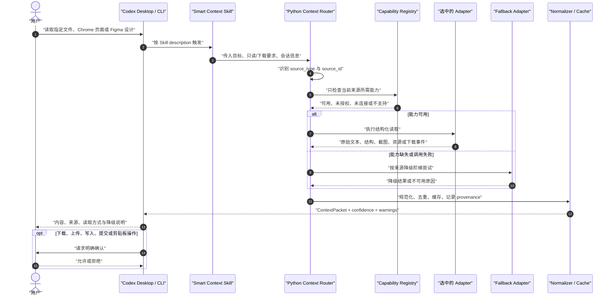
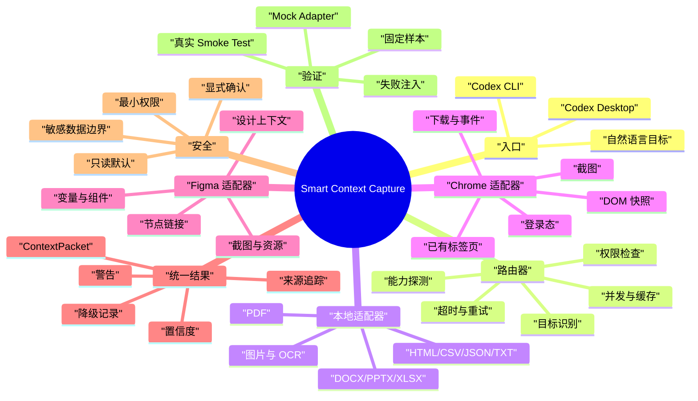

# Smart Context Capture — 项目规划

状态：设计阶段；当前只建立项目骨架，不安装第三方工具、不启用生产 Skill。

## 1. 一句话定义

为 Codex Desktop 和 Codex CLI 提供一个统一入口：根据用户指定的目标，在本地文件、已连接的 Chrome、Figma MCP 之间选择最佳读取路径，统一结果格式，并在依赖缺失时安全降级。

## 2. 目标与边界

### 目标

- 读取本地下载文件，并保留文本、表格、页面和图片/OCR结构。
- 读取用户当前 Chrome 标签页、登录态页面和下载事件（前提是 Chrome Bridge 已连接）。
- 读取 Figma 节点的结构化设计上下文、截图和可下载资源（前提是 Figma MCP 已授权）。
- 让 Desktop 与 CLI 通过同一 Skill 规范和统一输出契约工作。
- 对缺失、断开或权限不足的适配器进行可解释降级。

### 非目标

- 不重新实现 Chrome、Figma 或 PDF/Office 的底层能力。
- 不绕过登录、浏览器权限、Figma 权限或操作系统文件权限。
- 不默认读取 cookies、密码、剪贴板、无关标签页或无关文件。
- 第一阶段不做自动写入 Figma、自动提交表单或自动上传文件。

## 3. 分层架构

```text
Codex Desktop / CLI
        │  Skill workflow
        ▼
Smart Context Skill
        │  intent + source routing
        ▼
Python Context Router
        ├── Capability Registry / health checks
        ├── Local Adapter       → MarkItDown / LiteParse / Python libraries
        ├── Chrome Adapter      → open-browser-use / Browser Relay / Chrome MCP
        ├── Figma Adapter       → official Figma MCP / Figma Skills
        ├── Cache + concurrency
        └── Normalizer → ContextPacket
```

原则：Skill 负责流程，Python 负责确定性处理与统一，第三方适配器负责真实数据访问。不要把所有 MCP 深度嵌套进 Python；优先调用它们稳定的 CLI、HTTP 或 SDK 接口，必要时再做 MCP 适配。

## 4. 统一输出契约

所有适配器最终转换为 `ContextPacket`：

```json
{
  "source_type": "local_file | chrome_tab | figma_node",
  "source_id": "stable id or path",
  "title": "human-readable title",
  "uri_or_path": "source locator",
  "content": "normalized markdown/text",
  "structured_data": {},
  "assets": [],
  "screenshots": [],
  "provenance": [],
  "confidence": "high | medium | low",
  "warnings": [],
  "adapter": "adapter name",
  "fallback_used": false
}
```

## 5. 路由与降级策略

### 路由

1. 识别来源：路径/文件、当前 Chrome、URL/标签页、Figma URL/节点。
2. 检查该来源所需能力，不检查无关提供方。
3. 先走结构化、直接、权限明确的路径。
4. 对结果做去重、截断、分块、缓存和元数据补全。
5. 返回内容及其来源、置信度、耗时和警告。

### 降级阶梯

- 本地文件：原生结构化解析 → 普通文本提取 → OCR/视觉 → 请求用户上传或导出。
- Chrome：已有标签页 Bridge → 独立浏览器/公开 HTTP → 页面截图/视觉 → 请求用户复制或导出。
- Figma：Figma MCP 结构化上下文 → 已授权导出/API → 截图/视觉 → 请求用户提供节点链接或导出文件。

降级不得静默发生；如果结构语义丢失，必须明确标注，不能把低精度结果伪装成完整读取。

## 6. 详细时序图



## 7. 系统脑图



## 8. 分阶段实施顺序

### P0 — 契约与探测

- 固定 `ContextPacket`、错误码、置信度和来源追踪格式。
- 编写能力注册表：provider、状态、权限、版本、可用操作。
- 只做只读健康检查和错误分类。

验收：缺少任意一个提供方时，能清楚报告“缺什么、为何需要、如何降级”。

### P1 — 本地文件 MVP

- 接入 Python 解析链；先覆盖 TXT、HTML、CSV、JSON、PDF、DOCX、XLSX。
- 支持大小限制、编码检测、分页/分块、缓存和 OCR 标记。

验收：同一文件重复读取有缓存；表格、页码、图片 OCR 均可追溯。

### P2 — Chrome 只读适配器

- 只选一个主方案，优先评估 `open-browser-use` 或官方 Chrome 能力。
- 支持列出标签页、按标题/URL匹配、DOM快照、截图和下载列表。
- 不读取 cookies/passwords，不默认操作无关标签页。

验收：能读取用户指定的已有标签页；未连接时在有限时间内明确降级。

### P3 — Figma 只读适配器

- 接入官方 Figma MCP；以节点链接为主，支持设计上下文、截图和资源引用。
- 记录文件/节点 ID、账号授权状态和资源下载结果。

验收：结构化结果和视觉截图都能回溯到同一个节点。

### P4 — 统一路由与降级

- 将三类适配器接入同一 Router。
- 实现按来源的降级阶梯、超时、缓存、失败注入和可解释警告。

验收：单个适配器断开时，其余来源仍可用；低精度结果不会伪装成高精度结果。

### P5 — Codex 集成与评估

- 完善 `SKILL.md` 触发描述和最小工作流。
- 分别验证 Desktop 和 CLI 的 Skill/MCP 发现、配置和重启行为。
- 用固定样本、真实只读任务和权限拒绝场景进行回归测试。

验收：相同请求在 Desktop/CLI 获得同一结果契约，差异只来自可用后端。

## 9. 速度、精准度和体验控制点

- 只对当前任务做懒加载和健康检查，避免每轮检查所有服务。
- 本地解析和缓存尽量先行，减少模型直接处理原始大文件的成本。
- 优先结构化数据，其次 DOM/API，再次截图/OCR；每次降级都记录原因。
- 失败重试要有上限；禁止“无限等待 MCP”。
- 返回“读取来源、适配器、置信度、警告、是否降级”，让用户理解结果边界。
- 下载、上传、写入、表单提交和剪贴板读取始终需要明确确认。

## 10. 主要风险与对策

| 风险 | 对策 |
|---|---|
| 第三方扩展/MCP断开 | 能力注册表、超时、有限重试、备用适配器 |
| 不同平台配置不一致 | 统一配置检查，Desktop/CLI 启动诊断 |
| 结构信息在截图/OCR降级中丢失 | 置信度和警告，要求用户确认关键结论 |
| 登录态和本地文件泄露 | 最小权限、来源白名单、只读默认、敏感数据不采集 |
| 依赖过多导致维护困难 | 适配器接口稳定，第一阶段每个来源只选一个主后端 |
| MCP嵌套导致认证复杂 | 优先使用供应方 CLI/HTTP/SDK；只在必要时代理 MCP |

## 11. 当前建议的最小组合

- 核心：Python Router + `ContextPacket` + capability registry。
- 本地：MarkItDown 或 LiteParse。
- Chrome：先做 `open-browser-use` 适配器评估。
- Figma：官方 Figma MCP。
- 第一版本：只读、可解释降级，不做自动写入和复杂远程控制。

## 12. 需要最终确认的产品选择

1. 第一版本是否只支持 Windows，还是一开始就做 macOS/Linux？
2. 是否先限制为只读与下载，不做 Figma 写入和浏览器表单提交？
3. Chrome 主后端选择 `open-browser-use`、官方 Chrome 集成，还是两者并存？
4. 本地文件首批必须覆盖哪些格式？
5. 结果是只返回给 Codex，还是同时保存可复用的本地上下文缓存？

## 13. 发布与分发路线

推荐采用“源码、个人安装、官方目录”三层路线，而不是一开始就把所有东西塞进一个安装包：

1. **开发与源码**：放在公开 GitHub 仓库，Skill、Python Gateway、适配器接口、测试和文档都在同一仓库中。
2. **个人/内测安装**：直接把 Skill 放入用户级 Skill 目录，或通过仓库/本地 marketplace 安装；第三方 Chrome 扩展、MCP 和账号授权仍由用户按需配置。
3. **正式分发**：将 `SKILL.md` 和可选 MCP/资源包装成带 `.codex-plugin/plugin.json` 的 Codex Plugin，并提交 OpenAI Plugin submission portal。审核通过后，skills-only 或 skills-plus-MCP 插件可以进入 ChatGPT 与 Codex 共用的 Plugins Directory。

Python Gateway 可以另外发布为 PyPI/npm 包，也可以随插件提供启动脚本；它不应把用户的 Chrome Profile、Figma 登录态或密钥打包进去。

官方参考：

- [Build skills](https://developers.openai.com/plugins/build/skills)
- [Package your plugin](https://developers.openai.com/plugins/build/plugins)
- [Submit plugins](https://developers.openai.com/plugins/deploy/submission)

当前项目先按“GitHub 源码 + 本地 Skill/Plugin 测试”搭建，等接口稳定后再决定是否提交官方目录。

## 14. 当前开发状态

- P0：`ContextPacket`、能力注册表、来源识别与路由已完成。
- P1：本地只读解析已完成，覆盖文本/代码、Markdown、HTML、CSV/TSV、JSON；具备大小限制、编码回退、结构化输出和来源追踪。
- P2：Chrome CDP 只读适配器已完成；需要用户显式暴露 CDP 端口，未连接时快速返回降级原因。
- P3：Figma REST 只读适配器已完成；需要显式 `FIGMA_ACCESS_TOKEN`，支持节点树、组件/样式摘要和可选渲染 URL。
- P4：统一 Gateway、CLI 和本地 Plugin 包装已完成；第三方 MCP/扩展仍可替换对应传输层。

当前可用命令：

```text
smart-context <path-or-url> [--source auto|local_file|chrome_tab|figma_node] [--pretty]
```

未配置 Chrome CDP 或 Figma token 时，命令会返回结构化错误和缺失能力，不会静默读取其他来源。

## 15. 本轮补充

- 可选 `MarkItDownAdapter`：安装 `markitdown` 后接入 PDF/Office/EPUB 等富文档，未安装时能力状态为 `unavailable`。
- 可选 `FilePacketCache`：只有传入 `--cache-dir` 才持久化，文件大小或修改时间变化会自动换缓存键。
- Figma 渲染资源下载要求 `--download-dir` 与 `--confirm-download` 同时出现。
- 项目根目录包含 `.codex-plugin/plugin.json`、`skills/`、`src/`、测试和文档，可作为单一源码/Plugin 包使用。
- 新增 `public-http` 低权限网页适配器：公开 URL 优先走直接 HTTP，不使用 Cookie、不执行 JavaScript；只有需要登录态、动态渲染或视觉交互时才升级到 Connector/CDP/Computer Use。
- `ContextPacket` 新增 `access_mode`，明确区分本地读取、公开 HTTP、浏览器 CDP、Figma token 和更高权限的操作路径。
- 路由器现在默认让普通 `http(s)` URL 走 `public-http`，只有显式 `--browser-session`（或 `current`/Chrome 内部页）才优先浏览器会话；避免 CDP 可用时仍无必要升级权限。
- 路由探测改为按权限阶梯懒探测；普通 URL 在公共 HTTP 可用时不等待 CDP 健康检查，并在 `ContextPacket.provenance` 追加网关耗时。
- 公共 HTML 若疑似 JavaScript 空壳，会标记 `javascript_required_suspected`、降低置信度并给出明确升级建议，而不会自动申请 Computer Use。
- Packet 序列化、链接、provenance 和可选缓存会脱敏 URL userinfo 与常见 token/session/password 查询参数；原始值只在请求过程中使用。

## 16. 已识别缺口与处理策略

| 缺口 | 影响 | 当前处理 | 后续优先级 |
|---|---|---|---|
| Codex/操作系统授权 | Computer Use、Full CDP 仍可能要求最高权限 | Skill 不能绕过授权；新增公开 HTTP 低权限路径，并记录 `access_mode` | P0 |
| 公开网页依赖 JavaScript、登录态或 CAPTCHA | 直接 HTTP 可能拿到空壳页面或登录页 | 明确标记未执行 JS/未使用 Cookie，升级到 Connector/CDP | P0 |
| “当前前台 Chrome 标签页” | 原生 CDP 不保证暴露前台 tab，猜错页面会损害准确性 | 多页面时拒绝 `current`，要求 URL/标题/id；前台 tab 使用 Connector/Relay | P0 |
| 第三方 MCP/扩展版本漂移 | 调用失败、字段变化、连接中断 | 能力探测、超时、统一适配器契约和可解释降级 | P1 |
| PDF/Office/扫描件复杂版式 | 表格、公式、OCR、分页可能丢失 | MarkItDown 可选接入；保留格式/置信度/警告 | P1 |
| Figma REST 与官方 MCP 的信息差 | 变量、组件上下文、权限和视觉信息不完全等价 | 官方 MCP 优先，REST 作为 token 驱动 fallback | P1 |
| 缓存与敏感数据 | 持久缓存可能保存文件或页面内容 | 默认关闭；显式 `--cache-dir`，来源和缓存路径可追踪 | P0 |
| 下载/写入副作用 | 误覆盖文件或触发外部操作 | Figma 下载需显式确认和冲突改名；其他写操作暂不默认开放 | P0 |
| 跨平台差异 | Windows、macOS、Linux 的浏览器启动和权限不同 | 核心使用标准库；仍需各平台 smoke test | P2 |
| 性能可观测性 | 难以判断慢在网络、MCP、OCR 还是模型 | 已有缓存和超时；下一步增加耗时、重试次数和 provider trace | P2 |
| 真实网页回归覆盖 | 合成测试不能代表 SPA、反爬和登录站点 | 下一阶段建立脱敏样本集和 connector smoke test | P2 |

## 17. 官方提交准备

- 按官方规则选择 **Skills only**，因为当前版本没有自有 MCP server，也不引用已发布的第三方集成 ID。
- `.codex-plugin/plugin.json` 已补齐发布友好的描述、作者占位为贡献者团队、MIT license、关键词、能力、starter prompts 和品牌色；真实开发者身份、网站、支持、隐私、条款 URL 不伪造。
- `submission/` 提供 listing 草稿、隐私/条款草稿、release notes，以及五个正向和三个负向测试用例。
- 正式提交前仍需将最终 Skill 文件树上传到官方 Portal，并由拥有 Apps Management 写权限且完成身份验证的组织提交；审核通过后再发布到 ChatGPT/Codex Plugins Directory。
